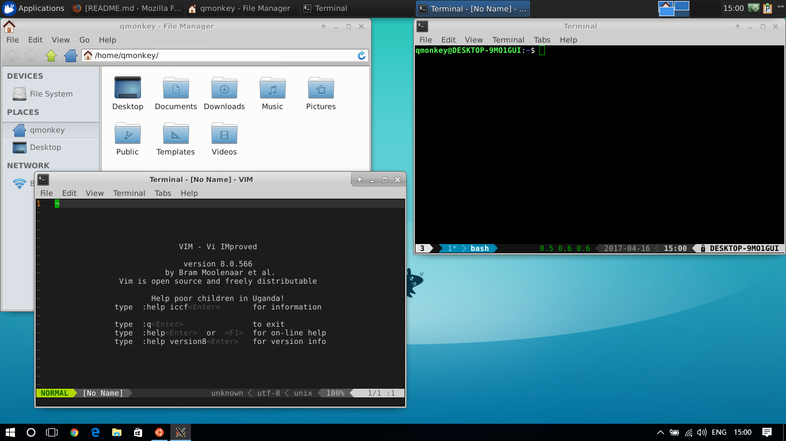
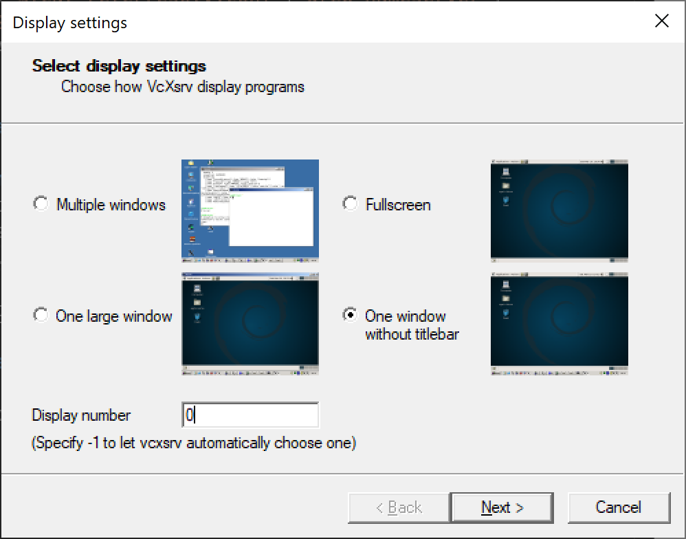

# wsl-tutorial

The tutorial will tell you how to run desktop environment inside Windows Subsystem for Linux. And you don't need to build a developement environment with virtual machines any more. :)

## Screenshot



## Prerequisites

Your PC must be running a 64-bit version of **Windows 10 Anniversary Update build 14393 or later**.

To find your PC's CPU architecture and Windows version/build number, open **Settings>System>About**. Look for the OS Build and System Type fields.


## Installation

In order to run Bash on Windows, you will need to manually:

#### 1.Turn-on Developer Mode


#### 2.Enable the “Windows Subsystem for Linux (beta)” feature


## After enabling Windows Subsystem for Linux

#### 1.Restart your computer

#### 2.Run bash


After you have accepted the License, the Ubuntu user-mode image will be downloaded and a “Bash on Ubuntu on Windows” shortcut will be added to your start menu.

## Install VcXsrv

Install the lastest version of [VcXsrv](https://sourceforge.net/projects/vcxsrv/).

## Upgrade ubuntu

```bash
sudo apt-get update
sudo apt-get upgrade
```

## Install xfce desktop

```bash
sudo apt-get install xfce4-terminal
sudo apt-get install xfce4
```

## Specify the display server

Add DISPLAY=:0.0 to your `~/.bashrc`, and don't forget to run `source ~/.bashrc`. :)

```bash
export DISPLAY=:0.0
export LIBGL_ALWAYS_INDIRECT=1
```

## Fix dbus error (Only Ubuntu 14.04 and Ubuntu 16.04)

You need to replace

```xml
<listen>unix:tmpdir=/tmp</listen>
```

with

```xml
<listen>tcp:host=localhost,port=0</listen>
```

in /etc/dbus-1/session.conf.

## Fix connection refused (Only Ubuntu 14.04)

You need to replace

```xml
<auth>EXTERNAL</auth>
```

with

```xml
<auth>ANONYMOUS</auth>
<allow_anonymous/>
```

in /etc/dbus-1/session.conf.

## Open display server

Open **XLaunch**, choose “One large window” or “One large window without titlebar” and set the “display number” to 0.
Other settings leave as default and finish the configuration.



## Run xfce desktop

Execute the following command inside “Bash on Ubuntu on Windows”.

```bash
startxfce4
```

## Fix powerline fonts rendering

Install the lastest version of [Hack](https://github.com/source-foundry/Hack#linux) fonts.

## Fix Unicode fonts rendering

```bash
sudo apt-get install fonts-noto
sudo apt-get install fonts-noto-hinted
sudo apt-get install fonts-noto-mono
sudo apt-get install fonts-noto-unhinted
```

## Fix Chinese fonts rendering

```bash
sudo apt-get install fonts-noto-cjk
```

## Fix mkdir command has wrong permissions

Add the following shell code to your bashrc

```bash
if grep -q Microsoft /proc/version; then
    if [ "$(umask)" == '0000' ]; then
        umask 0022
    fi
fi
```

## Install Chinese input method

#### 1.Install fcitx

```bash
sudo apt-get install fcitx
sudo apt-get install fcitx-pinyin
```

#### 2.Add the following command to your bashrc file

```bash
export XMODIFIERS=@im=fcitx
export GTK_IM_MODULE=fcitx
export QT_IM_MODULE=fcitx
```

#### 3.Relogin

## Install drop-down terminal

```bash
sudo apt-get install guake
```

## How to shutdown wsl

#### 1.Close VcXsrv

#### 2.Exit “Bash on Ubuntu on Windows”

## Enjoy your self

Please enjoy your development environment. :)

## References

- [Microsoft wsl install guide](https://msdn.microsoft.com/en-us/commandline/wsl/install_guide)
- [Run any Desktop Environment in WSL](https://github.com/Microsoft/BashOnWindows/issues/637)
- [Bash on windows getting dbus and x server working](https://www.reddit.com/r/Windows10/comments/4rsmzp/bash_on_windows_getting_dbus_and_x_server_working/)
