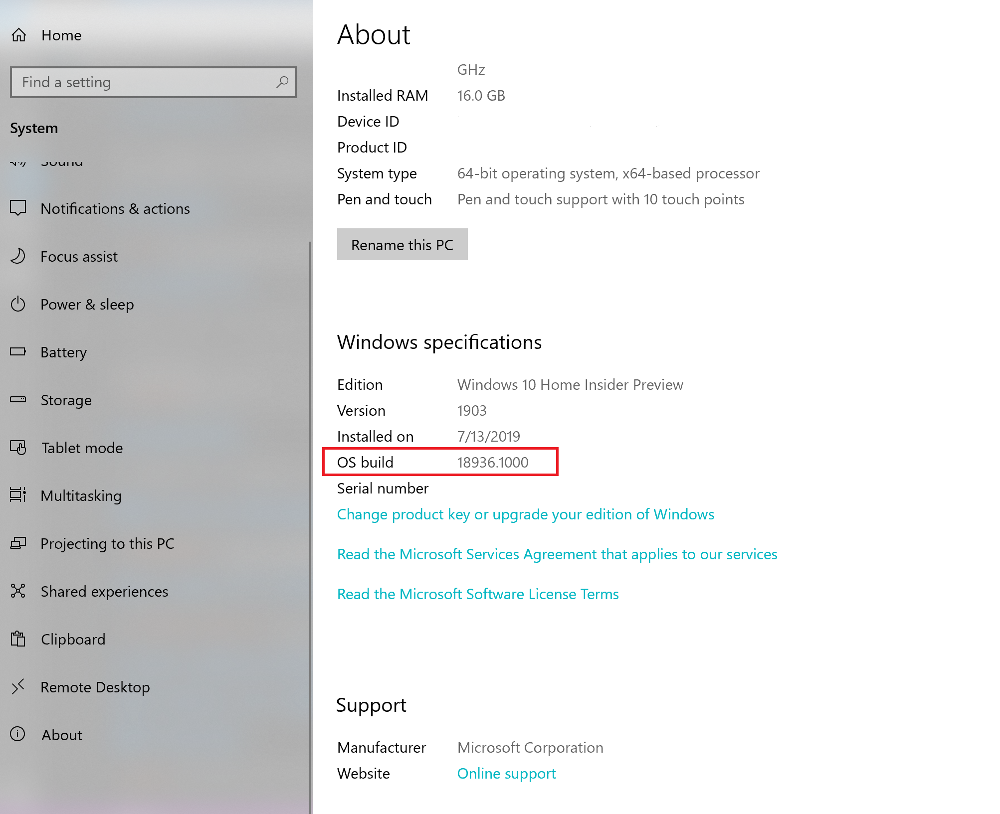
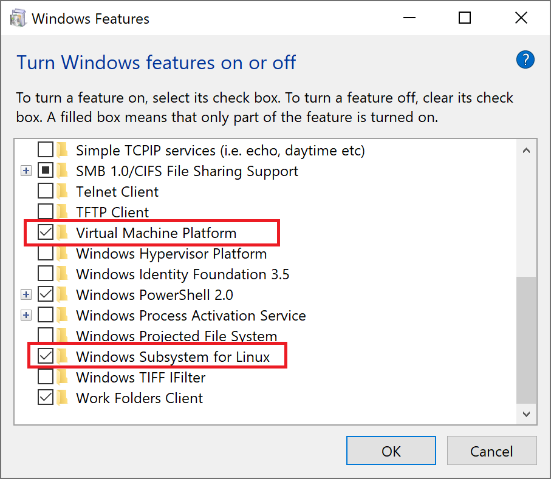
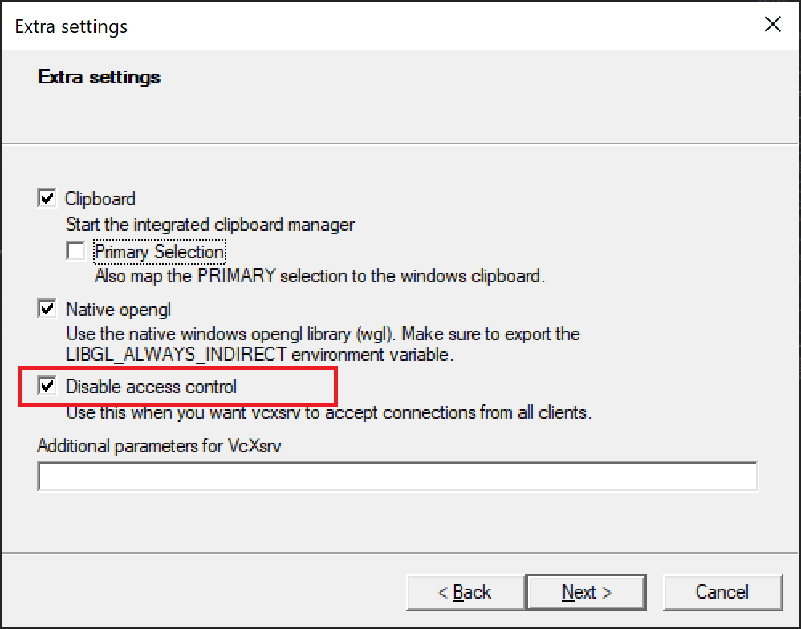
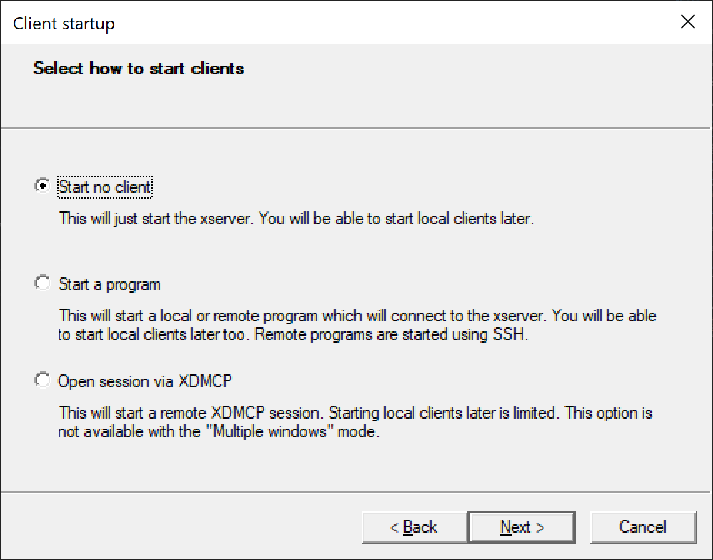
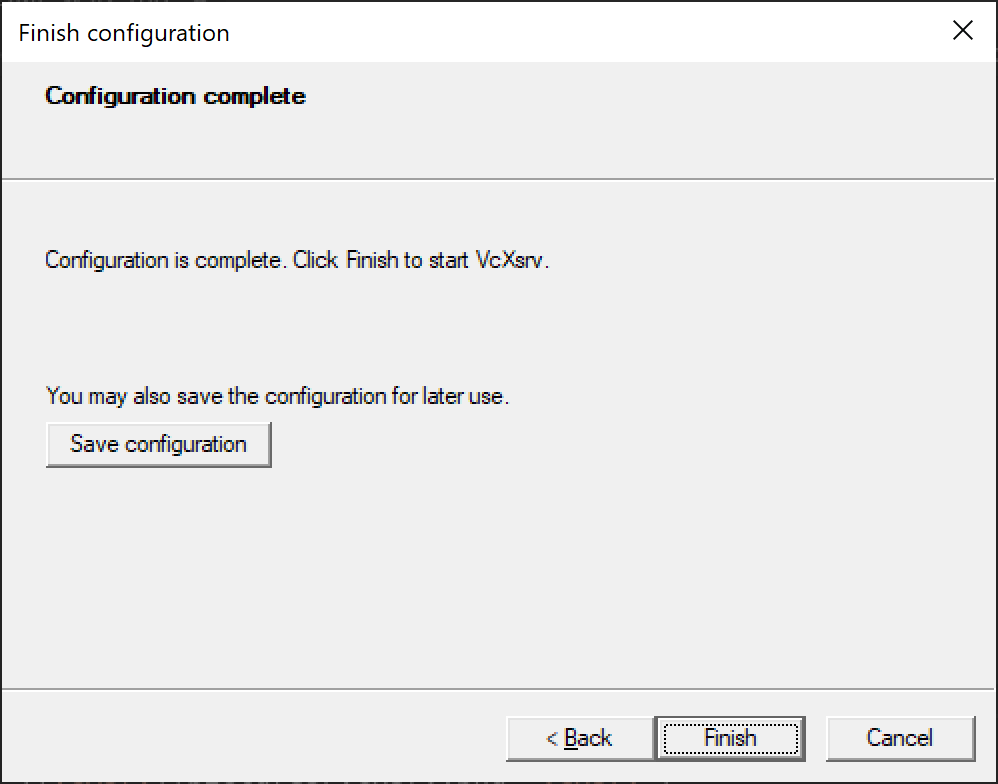

# wsl2-tutorial

The tutorial will tell you how to run desktop environment inside Windows Subsystem for Linux. And you don't need to build a developement environment with virtual machines any more. :)

## Screenshot


## Prerequisites

Please note that you'll need to be running **Windows 10 build 18917 or higher**.

To find your Windows version, open **Settings>System>About** and look for the "OS build" field.


## Enable windows features

#### 1. Enable the "Virtual Machine Platform" and "Windows Subsystem for Linux" feature



#### 2. Restart your computer

## Install Ubuntu

#### Install "Ubuntu 16.04 LTS" or "Ubuntu 18.04 LTS" in Microsoft Store

## Set Ubuntu to be backed by WSL 2

In PowerShell run:

```
wsl --set-version <Distro> 2
```

Make sure to replace <Distro> with the actual name of your distro. (You can find these with the command: wsl -l).

Additionally, run the command below to make WSL 2 your default architecture:

```
wsl --set-default-version 2
```

## Install VcXsrv

Install the lastest version of [VcXsrv](https://sourceforge.net/projects/vcxsrv/).

## Upgrade Ubuntu

```bash
sudo apt-get update
sudo apt-get upgrade
```

## Install xfce desktop

```bash
sudo apt-get install xfce4-terminal
sudo apt-get install xfce4
```

## Specify the display server

Add bellow code to your `~/.bashrc`, and don't forget to run `source ~/.bashrc`. :)

```bash
export DISPLAY=$(cat /etc/resolv.conf | grep nameserver | awk '{print $2}'):0
export LIBGL_ALWAYS_INDIRECT=1
```

## Launch display server

Open **XLaunch**, choose "One large window" or "One large window without titlebar", set the "display number" to 0 and click "Next.


Check "Disable access control" and click "Next".



Choose "Start no client" and click "Next".



Click "Finish" to launch display server.



## Run xfce desktop

Execute the following command inside Ubuntu.

```bash
startxfce4
```

## Fix powerline fonts rendering

Install the lastest version of [Hack](https://github.com/source-foundry/Hack#linux) fonts.

## Fix Unicode fonts rendering

```bash
sudo apt-get install fonts-noto
sudo apt-get install fonts-noto-hinted
sudo apt-get install fonts-noto-mono
sudo apt-get install fonts-noto-unhinted
```

## Fix Chinese fonts rendering

```bash
sudo apt-get install fonts-noto-cjk
```

## Fix mkdir command has wrong permissions

Add the following shell code to your bashrc

```bash
if grep -q microsoft /proc/version; then
    if [ "$(umask)" == '0000' ]; then
        umask 0022
    fi
fi
```

## Install Chinese input method

#### 1. Install fcitx

```bash
sudo apt-get install fcitx
sudo apt-get install fcitx-pinyin
```

#### 2. Add the following command to your bashrc file

```bash
export XMODIFIERS=@im=fcitx
export GTK_IM_MODULE=fcitx
export QT_IM_MODULE=fcitx
```

#### 3. Relogin

## Install drop-down terminal

```bash
sudo apt-get install guake
```

## How to shutdown wsl

#### 1. Close VcXsrv

#### 2. Exit Ubuntu

## Enjoy your self

Please enjoy your development environment. :)

## References

- [Installation Instructions for WSL 2](https://docs.microsoft.com/en-us/windows/wsl/install)
- [Can't use X-Server in WSL 2](https://github.com/microsoft/WSL/issues/4106)
